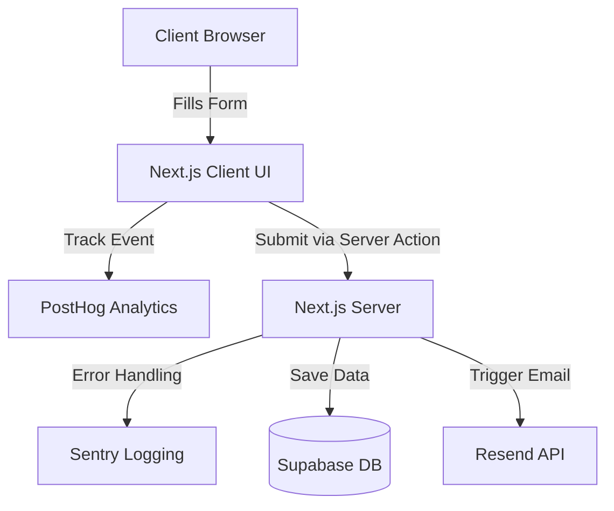

<div align="center">
  
  <h1 align="center">Omnivo | Agenție Web Design</h1>
  <p align="center">
    <strong>A Premium Web Design & Development Agency Platform</strong>
    <br />
    Next.js 15+ App Router • React Server Components • Supabase • Tailwind CSS
  </p>

  <p align="center">
    
    
    
    
  </p>
</div>

---

## 📖 Overview

**Omnivo** is a cutting-edge web platform dedicated to showcasing professional web design and development services, providing transparent pricing with interactive calculators, and generating high-converting leads.

Built with an uncompromising focus on **Performance, SEO, and Accessibility**, the application delivers a highly interactive user experience through smooth Framer Motion animations and robust backend architecture driven by Server Actions.

---

## ✨ Features

- 🚀 **Blazing Fast Performance**: Consistently hits 95-100 on Google Lighthouse (even on simulated Slow 4G networks) through aggressive chunk splitting, IntersectionObserver lazy loading, and aggressive DOM optimization.
- 🎨 **Premium Modern Design**: Glassmorphism effects, a dynamic 3D MacBook animated hero mockup, and full support for dynamic **Dark/Light Mode**.
- 📅 **Advanced Booking System**: Client-side interactive forms using Next.js Server Actions linked directly to a Supabase PostgreSQL database.
- 💌 **Automated Email Dispatch**: Instant admin and user notifications upon booking using the Resend API.
- 📱 **Mobile-First & Responsive**: Beautifully crafted to look perfect on smartphones, tablets, and massive desktop screens.
- 👁️ **Accessibility (a11y) First**: Fully screen-reader compatible with proper ARIA labeling, semantic HTML hierarchy, and contrast ratios (Scoring 100/100 Accessibility).
- 📊 **Telemetry & Analytics**: Out-of-the-box integration with PostHog for user flow analytics and Sentry for real-time error tracking and performance monitoring.

---

## 🛠️ Tech Stack

### Core Technologies
- **Framework:** [Next.js (App Router)](https://nextjs.org/)
- **UI Library:** [React 18+](https://reactjs.org/)
- **Language:** [TypeScript](https://www.typescriptlang.org/) (Strict Mode)
- **Styling:** [Tailwind CSS](https://tailwindcss.com/)

### Backend & Cloud
- **Database:** [Supabase](https://supabase.com/) (PostgreSQL with RLS)
- **Email Service:** [Resend](https://resend.com/)

### Telemetry & UI Magic
- **Animations:** [Framer Motion](https://www.framer.com/motion/) & Tailwind CSS native transitions
- **Icons:** [Lucide React](https://lucide.dev/)
- **Analytics:** [PostHog](https://posthog.com/)
- **Monitoring:** [Sentry](https://sentry.io/)
- **Theming:** `next-themes`

---

## 🚀 How to Run Locally

Follow these instructions to get a copy of the project up and running on your local machine for development and testing purposes.

### Prerequisites

Ensure you have the following installed on your local machine:
- **Node.js** (v18.x or later)
- **npm** or **yarn**

### 1. Clone the repository

```bash
git clone https://github.com/AndreiNeptune/site-web-development.git
cd site-web-development
```

### 2. Configure Environment Variables

Create a new local environment file by copying the template:

```bash
cp .env.example .env.local
```

Open `.env.local` in your code editor and populate the variables with your own credentials:

```env
# Supabase Configuration
NEXT_PUBLIC_SUPABASE_URL=your_supabase_project_url
NEXT_PUBLIC_SUPABASE_ANON_KEY=your_supabase_anon_key

# Resend Mail
RESEND_API_KEY=your_resend_api_key

# PostHog Analytics
NEXT_PUBLIC_POSTHOG_KEY=your_posthog_project_key
NEXT_PUBLIC_POSTHOG_HOST=https://eu.i.posthog.com

# Sentry Monitoring
NEXT_PUBLIC_SENTRY_DSN=your_sentry_dsn
```

### 3. Install Dependencies

Install all required npm packages:

```bash
npm install
```

### 4. Run the Development Server

Start the application in development mode:

```bash
npm run dev
```

Open [http://localhost:3000](http://localhost:3000) in your browser to view the application. The page will reload automatically if you make edits to the code.

### 5. Build for Production

To create an optimized production build, run:

```bash
npm run build
```
Once the build completes successfully, you can start the production server to test it:
```bash
npm start
```

---

## 🏗️ Architecture Flow



<div align="center">
  <i>Built with ❤️ by the Omnivo team.</i>
</div>
